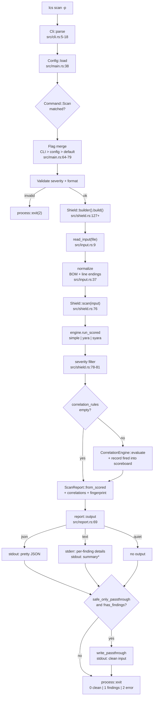

# Scan Data Flow

End-to-end trace of what happens when you run `lcs scan` — from process entry through input read, scan, correlation, output, and exit. Each step points at a specific file and line range, intended as a hand-rail when debugging or extending the pipeline.

The example walked here is `lcs scan -p` reading from stdin: the most common shape, with passthrough enabled (safe input flows through to stdout, dirty input is suppressed). Variations — file input, `--format json`, scan groups — diverge at marked branch points.

## Diagram

`*` Summary on stdout is suppressed when `-p` is set, so the pipe stays clean for downstream consumers.

## Walkthrough

### 1. Process entry, CLI parse

- **A.** `fn main()` at `src/main.rs:24`. First line is `Cli::parse()`; clap auto-generates the parser from `src/cli.rs:5-18`.
- **B.** `lcs` is the binary name (`Cargo.toml [[bin]]`); `scan` matches `Command::Scan { ... }` at `src/cli.rs:23`.
- **C.** `-p` short → `safe_only_passthrough: bool` at `src/cli.rs:44-45`. No filename means `file: Option<PathBuf>` is `None` — input will come from stdin.

### 2. Config and logging bootstrap

- **A.** First-run check at `src/main.rs:29-35`: if invoked with no args and the XDG config dir is missing, write a default `config.toml`.
- **B.** `Config::load()` at `src/main.rs:38` reads `$XDG_CONFIG_HOME/llm_context_shield/config.toml` if present; falls back to `Config::default()` on parse error.
- **C.** Logging at `src/main.rs:44-47` is initialised only if `--log` was passed or `[log] = true` was set in config.

### 3. Subcommand dispatch

`match cli.command { Command::Scan { ... } }` at `src/main.rs:51-52` destructures all flags including `safe_only_passthrough` and `output: output_file`.

### 4. Flag merge: CLI > config > built-in default

`src/main.rs:64-79`. Each flag falls back through three tiers: CLI argument, then `[scan]` section in config.toml, then a hard-coded default (`"text"`, `"low"`, `"simple"`).

### 5. Validate format and severity

- **A.** `Severity::from_str_loose` at `src/main.rs:90` accepts `low|medium|high|critical` case-insensitively. On miss: `error!` (tracing) + `eprintln!` + `process::exit(2)`.
- **B.** Format whitelist at `src/main.rs:96-100`.

### 6. Build the `Shield`

- **A.** `Shield::builder()` chain at `src/main.rs:102-112`. Calls `engines::build(name, &config)` at `src/engines/mod.rs:120` to materialize the engine (`simple`, `yara`, or `syara`); wires in correlation rules from `config.correlation` plus the bundled set.
- **B.** `.build()` returns `Result<Shield, ShieldError>`; on error, exit 2 with the message.

### 7. Read input

- **A.** `read_input(file.as_deref())` at `src/main.rs:114` → `src/input.rs:9`.
- **B.** With `file = None`, reads stdin up to a 100 MiB cap (`MAX_INPUT_BYTES`, `src/input.rs:7`); rejects larger.
- **C.** `normalize()` at `src/input.rs:37` strips the UTF-8 BOM and normalises line endings to `\n`. **This is the only mutation between user bytes and engine input.**
- **D.** Any I/O error here exits 2.

### 8. `Shield::scan(input)` — the heart of the scan

`src/shield.rs:76`. Single entry point.

- **A. Engine pass.** `self.engine.run_scored(input, &self.disabled)` at `:77` returns `(Vec<Finding>, ThreatScoreboard)`. The simple engine iterates registered scanners (`src/scanners/mod.rs::build`); the YARA-X / SYARA-X engines compile rules at builder time and match in this call.
- **B. Severity filter.** `:78-81` drops findings below `min_severity` *before correlation runs*. Correlations only see surviving findings.
- **C. Correlation pass.** `:83-95`. Skipped if `correlation_rules.is_empty()`. Otherwise builds a single `EngineFindings` bucket (single-scan mode = one engine), runs `CorrelationEngine::evaluate(&buckets, &rules)`, and `scores.record(...)`s each fired correlation's composite threat back into the scoreboard.
- **D. Assemble.** `ScanReport::from_scored(filtered, scores).with_correlations(...).with_rule_set_fingerprint(...)` at `:97-99`.

### 9. Emit output

- **A.** `src/main.rs:137-149` calls `report::output(&report, &format, min_severity, safe_only_passthrough, ...)`.
- **B.** `src/report.rs:69` branches on format:
  - **json** → `render_scan_report_json(report, min_severity, true)` (the helper shared with scan-group) → `serde_json::to_writer_pretty` to stdout.
  - **quiet** → no-op.
  - **text** → per-finding details to **stderr** (`src/report.rs:99-113`); summary line to **stdout** *only when not in passthrough mode* (`:151-170`).
- **C.** `passthrough_mode = true` suppresses the stdout summary so the pipe stays clean for downstream consumers.

### 10. Passthrough

- **A.** `src/main.rs:153-160`. Triggered only when `safe_only_passthrough && !has_findings`.
- **B.** `write_passthrough(&input, output_file.as_deref())` at `src/report.rs:50` writes the *normalized* input (post-step-7-C) either to `--output FILE` or to stdout.
- **C.** If findings exist, nothing is written to stdout — the pipe ends cleanly with exit 1.

### 11. Exit

- **A.** `let exit_code = if has_findings { 1 } else { 0 };` at `src/main.rs:162`.
- **B.** `process::exit(exit_code)` at `:164`.

## Exit-code contract

| Code | Meaning                                              |
|------|------------------------------------------------------|
| 0    | Clean — no findings at or above `--severity`.        |
| 1    | Findings detected.                                   |
| 2    | Error — bad flag, unreadable file, build failure.    |

## Pipe contract for `-p`

stdout receives either:

- **a)** the safe input verbatim if the scan is clean, or
- **b)** nothing if the scan finds threats.

stderr always receives finding details (text mode). The exit code distinguishes the two cases. That's why `lcs scan -p < user_msg.txt | next-tool` is the canonical safe-relay pattern: downstream tools see a clean payload or no payload at all, never partial or polluted.

## Variations

| Variant                      | Diverges at | Notes                                                                                      |
|------------------------------|-------------|--------------------------------------------------------------------------------------------|
| `lcs scan FILE`              | step 7      | `read_input` reads the file (with the same 100 MiB cap) instead of stdin.                  |
| `lcs scan --format json`     | step 9      | JSON to stdout; `findings` array, `threat_scores`, optional `correlations`, `rule_set_fingerprint`. |
| `lcs scan -p -o out.txt`     | step 10     | `write_passthrough` writes the normalized clean input to `out.txt` instead of stdout.      |
| `lcs scan-group A.txt B.txt` | step 8      | `Shield::scan_group` (`src/scan_group.rs`) loops single-scan over each input, then runs a cross-input correlation pass with synthetic `"input:<label>"` engine buckets. Output goes through `render_group_json` / `output_group_text`. |

## Key invariants

- `normalize()` is the only transform between user bytes and engine input. Engines see normalized text; byte ranges in findings are relative to the normalized form.
- Severity filtering runs **inside** `Shield::scan` (before correlation), and **again** at `report::output` time. The double-filter is by design: library callers may construct a Shield once with a permissive `min_severity` and re-render with a stricter one. CLI users pass the same severity to both, so the second filter is a no-op.
- Correlations only fire over findings that survived severity filtering. A correlation that depends on a Low-severity finding will silently drop if the Shield was built with `min_severity = Medium`.
- With `-p` set, stdout receives one of two byte streams: the normalized clean input, or nothing. Never both, never partial.
- Exit code is the source of truth for the dirty/clean distinction. Text and quiet modes do not write a sentinel to stdout; only the exit code is reliable.
