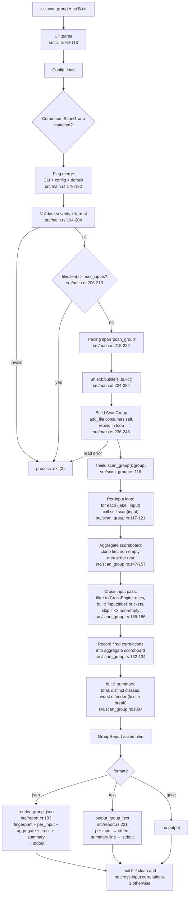

# Scan-Group Data Flow

End-to-end trace of what happens when you run `lcs scan-group <files>...` — from process entry through input collection, per-input scan, aggregation, cross-input correlation, output, and exit. Each step points at a specific file and line range. Companion to [scan-data-flow-simple.md](scan-data-flow-simple.md), which covers the single-scan path; this document focuses on what `scan-group` adds *on top of* that path.

The example walked here is `lcs scan-group A.txt B.txt --format json`: two positional files, JSON output. Variations — text/quiet output, `--max-inputs`, `--correlations` — are noted at branch points.

## Diagram



## Walkthrough

### 1. CLI parse

- **A.** `fn main()` at `src/main.rs:24` runs `Cli::parse()` against the schema in `src/cli.rs:5-18`.
- **B.** `scan-group` matches `Command::ScanGroup { files, format, severity, ... }` at `src/cli.rs:64`. The variant carries every per-scan flag (`format`, `severity`, `disable`, `engine`, `threat_scores`, `correlations`, `show_fingerprint`) plus one new flag: `max_inputs: usize` (default 1000).
- **C.** **No stdin support.** `files: Vec<PathBuf>` is `#[arg(required = true, num_args = 1..)]` at `src/cli.rs:67`, so clap rejects empty invocations with a usage error and exit 2 before any handler runs.

### 2. Config and logging bootstrap

Same as single-scan — see [scan-data-flow-simple.md §2](scan-data-flow-simple.md#2-config-and-logging-bootstrap).

### 3. Subcommand dispatch

`match cli.command { Command::ScanGroup { ... } }` at `src/main.rs:167` destructures all flags including the new `max_inputs`.

### 4. Flag merge

`src/main.rs:178-192`. Same three-tier fallback as single-scan (CLI > `[scan]` config section > built-in default). Note that `--max-inputs` has no config tier — it's a CLI-only flag, default from `default_value_t = 1000` at `src/cli.rs:104`.

### 5. Validate format and severity

`src/main.rs:194-204`. Identical to single-scan: invalid severity or format exits 2.

### 6. Pre-I/O guardrail (new)

`src/main.rs:206-213`. **This is unique to scan-group.** Before any file is opened:

```rust
if files.len() > max_inputs {
    eprintln!("Error: {} input(s) exceeds --max-inputs={max_inputs}", files.len());
    process::exit(2);
}
```

Why before I/O: shell glob expansion (`lcs scan-group ./*.txt`) can balloon to thousands of files. Failing fast on the positional count avoids reading any file when the cap is exceeded.

### 7. Tracing span

`src/main.rs:215-222`. `tracing::info_span!("scan_group", input_count, engine, format, severity)`. Mirrors single-scan's `"scan"` span; lets log readers distinguish the two modes when sifting through `~/.local/state/llm_context_shield/llm_context_shield.log`.

### 8. Build the `Shield`

`src/main.rs:224-234`. Same as single-scan. One Shield is built; **all per-input scans share it.** This means every input gets the same engine, the same `min_severity`, the same `disable` list, and the same rule-set fingerprint.

### 9. Build the `ScanGroup` (input collection)

`src/main.rs:236-246`. Iterate positional files; for each path, call `group.add_file(path)`:

```rust
let mut group = ScanGroup::new();
for path in &files {
    group = match group.add_file(path) {
        Ok(g) => g,
        Err(e) => { /* error, exit 2 */ }
    };
}
```

`add_file` at `src/scan_group.rs:67` **consumes `self`** and returns `io::Result<Self>` — that's why the loop rebinds. Each successful call appends `(label, content)` to the group, where `label` is `path.to_string_lossy().into_owned()` (the raw path as given on the command line; no canonicalization) and `content` is the file's bytes read into a `String`.

A read error on any file exits 2 immediately — no partial group is processed.

### 10. `Shield::scan_group(&group)` — the orchestrator

`src/scan_group.rs:116`. The library API the CLI wraps. Five sub-steps:

#### 10.A. Per-input scan loop (`src/scan_group.rs:117-121`)

```rust
let per_input: Vec<(String, ScanReport)> = group
    .inputs
    .iter()
    .map(|(label, input)| (label.clone(), self.scan(input)))
    .collect();
```

Each input runs through the **full single-scan path** documented in [scan-data-flow-simple.md §8](scan-data-flow-simple.md#8-shieldscaninput--the-heart-of-the-scan): `engine.run_scored` → severity filter → in-input correlation → `ScanReport`. Every per-input report is independent — its `findings`, `scores`, `correlations`, and `rule_set_fingerprint` reflect that single input only.

#### 10.B. Aggregate scoreboard (`src/scan_group.rs:147-157`)

```rust
fn build_aggregate_scoreboard(per_input: &[(String, ScanReport)]) -> ThreatScoreboard {
    let mut iter = per_input.iter().filter_map(|(_, r)| r.scores.as_ref());
    let mut agg = match iter.next() {
        Some(first) => first.clone(),
        None => ThreatScoreboard::new(),
    };
    for scores in iter {
        agg.merge(scores);
    }
    agg
}
```

**Why clone-first instead of `record`-each:** the first non-empty scoreboard carries the user's class weights (from `[scoring] class_weights` in config). Cloning preserves them. `ThreatScoreboard::merge` (`src/scoring.rs`) sums class scores and the cumulative directly — it does **not** re-apply weights, so per-input scores aren't double-weighted.

#### 10.C. Cross-input correlation pass (`src/scan_group.rs:159-186`)

The novel surface of scan-group. Reuses the existing `CorrelationEngine` with one trick: each input becomes its own `EngineFindings` bucket under a synthetic engine name `"input:<label>"`.

```rust
let cross_engine_rules: Vec<CorrelationRule> = self.correlation_rules.iter()
    .filter(|r| r.constraint == CorrelationType::CrossEngine)
    .cloned()
    .collect();
let buckets: Vec<EngineFindings> = per_input.iter()
    .filter(|(_, r)| !r.findings.is_empty())
    .map(|(label, report)| {
        let synthetic = format!("input:{label}");
        let findings = report.findings.iter()
            .map(|f| f.clone().with_engine(synthetic.as_str()))
            .collect();
        EngineFindings { engine: synthetic, findings }
    })
    .collect();
if buckets.len() < 2 { return Vec::new(); }
CorrelationEngine::evaluate(&buckets, &rules)
```

Three guards:

- **Only `CrossEngine` rules.** `Ordered`, `Proximate`, and `Combined` correlations have byte-position semantics that don't generalize across distinct inputs (byte 0 of input A and byte 0 of input B are not "near" each other). Filtered out.
- **Skip if fewer than two non-empty buckets.** A single-input group, or a group where only one input has findings, can't satisfy any cross-input constraint by definition.
- **Synthetic engine label bleed.** Findings cloned into the cross-input bucket carry `engine = "input:<label>"`, which propagates into the JSON output's `cross_input_correlations[].findings[].engine` field. This is intentional: it's how a JSON consumer attributes a cross-input correlation finding back to the source file. Per-input `ScanReport`s keep their original engine names (`"yara"`, `"syara"`, `"simple"`).

Each fired cross-input correlation also `record`s its composite into the aggregate scoreboard (`src/scan_group.rs:132-134`), with weights re-applied — this is the one place at the group level where weights *are* applied, because the composite is freshly minted at the cross-input layer.

#### 10.D. Summary (`src/scan_group.rs:188+`)

`build_summary` aggregates four numbers:

- `total_findings` — sum of per-input finding counts.
- `distinct_threat_classes` — count of classes in the aggregate scoreboard.
- `worst_offender_label` — `Option<String>`, the label whose scoreboard has the highest cumulative score.
- `worst_offender_cumulative` — that score.

Tie-break: lex-earlier label wins. The `max_by` uses `a.1.cmp(&b.1).then_with(|| b.0.cmp(&a.0))` so that on equal scores, the label that sorts first (alphabetically earlier) is preserved.

#### 10.E. Assemble `GroupReport`

`src/scan_group.rs:138-143`. Bundles `per_input`, `aggregate_scoreboard`, `cross_input_correlations`, and `summary`. Returned to the handler.

### 11. Emit output

Back in the handler at `src/main.rs:259-282`, branch on format:

#### 11.A. JSON (`src/main.rs:260-270`)

`render_group_json(&group_report, min_severity)` at `src/report.rs:183` builds the document:

```json
{
  "rule_set_fingerprint": "<64-hex>",
  "per_input": [
    {"label": "A.txt", "report": <per-scan JSON, no fingerprint>},
    {"label": "B.txt", "report": <per-scan JSON, no fingerprint>}
  ],
  "aggregate_scoreboard": {"class_scores": {...}, "cumulative": N},
  "cross_input_correlations": [...],
  "summary": {
    "total_findings": N,
    "distinct_threat_classes": N,
    "worst_offender_label": "..." | null,
    "worst_offender_cumulative": N
  }
}
```

The fingerprint is **lifted to the top level** because every per-input report shares it (same Shield → same rule set). Each per-input `report` object is built via `render_scan_report_json(report, min_severity, false)` — the same helper single-scan uses, with `include_fingerprint=false` to avoid duplication.

Pretty-printed via `serde_json::to_writer_pretty` to stdout.

#### 11.B. Text (`src/main.rs:272-281`)

`output_group_text(&group_report, threat_scores, correlations, show_fingerprint)` at `src/report.rs:221`. Splits across stderr and stdout, mirroring single-scan:

- **stderr:** per-input header lines (`[label] N finding(s), worst severity: <sev>`), per-input correlation detail (under `--correlations`), aggregate scoreboard (under `--threat-scores`), cross-input correlation detail (under `--correlations`), fingerprint (under `--show-fingerprint`).
- **stdout:** one summary line. Either `Summary: No threats detected across N input(s).` (clean) or `Summary: T total finding(s) across N input(s)[, X cross-input correlation(s)]; worst offender: <label> (cumulative C).` (dirty).

The stderr-details / stdout-summary split lets shell users run `lcs scan-group ... 2>/dev/null` to see only the bottom-line summary, or `... > /dev/null` to see only the detail block.

#### 11.C. Quiet

No-op. Exit code carries all the information.

### 12. Exit

`src/main.rs:284-287`:

```rust
let exit_code = if any_findings || any_cross_input { 1 } else { 0 };
process::exit(exit_code);
```

Cross-input correlations alone — even with zero per-input findings (impossible in practice, since cross-input requires findings to correlate over) — would still trigger exit 1.

## Exit-code contract

| Code | Meaning                                                                      |
|------|------------------------------------------------------------------------------|
| 0    | All inputs clean *and* no cross-input correlations fired.                    |
| 1    | Any input has findings *or* any cross-input correlation fired.               |
| 2    | Error — bad flag, oversized batch, unreadable file, build failure.           |

## Variations

| Variant                                          | Diverges at  | Notes                                                                          |
|--------------------------------------------------|--------------|--------------------------------------------------------------------------------|
| `lcs scan-group --format text A.txt B.txt`       | step 11      | Text emission via `output_group_text`. Default format if `-f` omitted.         |
| `lcs scan-group -f quiet ...`                    | step 11      | No output. Exit code only.                                                     |
| `lcs scan-group --correlations ...`              | step 11.B    | Per-input correlation detail (under each `[label]`) and cross-input detail (own block) appear in text mode. Always present in JSON. |
| `lcs scan-group --threat-scores ...`             | step 11.B    | Aggregate scoreboard block appears in text mode. Always present in JSON.       |
| `lcs scan-group --show-fingerprint ...`          | step 11.B    | Trailing `rule_set_fingerprint:` line on stderr in text mode. Always present in JSON. |
| `lcs scan-group --max-inputs N ...`              | step 6       | Lower N rejects oversized batches earlier. Default is 1000.                    |
| `lcs scan-group -e yara ...` / `-e syara`        | step 8       | Different engine; rule-set fingerprint changes accordingly. All inputs use the same engine. |

## Key invariants

- **All inputs share one `Shield`.** Same engine, same severity threshold, same disabled rules, same correlation rule set, same fingerprint. There is no per-input override.
- **Per-input scans are independent.** Each input is scanned as if it were a standalone `lcs scan` invocation. Findings, in-input correlations, scoreboards, and fingerprints in `per_input[].report` reflect only that input.
- **Cross-input correlation runs only over `CrossEngine` rules.** `Ordered`, `Proximate`, and `Combined` rules are filtered out at `src/scan_group.rs:125-130` because their byte-position semantics don't generalize across distinct inputs.
- **Cross-input correlation requires ≥2 non-empty buckets.** A group where only one input has findings cannot trigger any cross-input rule.
- **Symmetric `CrossEngine` rules fire exactly once per unordered pair of buckets.** Bug #4 (resolved 2026-05-01) added canonicalization in `CorrelationEngine::evaluate` so that `multi_engine_corroboration_*` rules don't double-fire on the (A, B) and (B, A) orderings.
- **Synthetic engine labels bleed into JSON output.** Findings inside `cross_input_correlations[].findings[]` carry `engine: "input:<label>"`, where `<label>` is the raw path the user passed on the command line. This is the join key for attributing a cross-input correlation back to its source files.
- **Aggregate scoreboard inherits config weights without double-applying them.** The first non-empty per-input scoreboard is cloned (preserving its weights); subsequent ones are merged via `ThreatScoreboard::merge`, which sums raw class scores and the already-weighted cumulative. Only cross-input correlation composites are `record`-ed (with weights applied) at the group level.
- **No passthrough mode.** `safe_only_passthrough` and `--output` are not exposed on `Command::ScanGroup`. Multi-input passthrough has no coherent stdout or single-file semantics.
