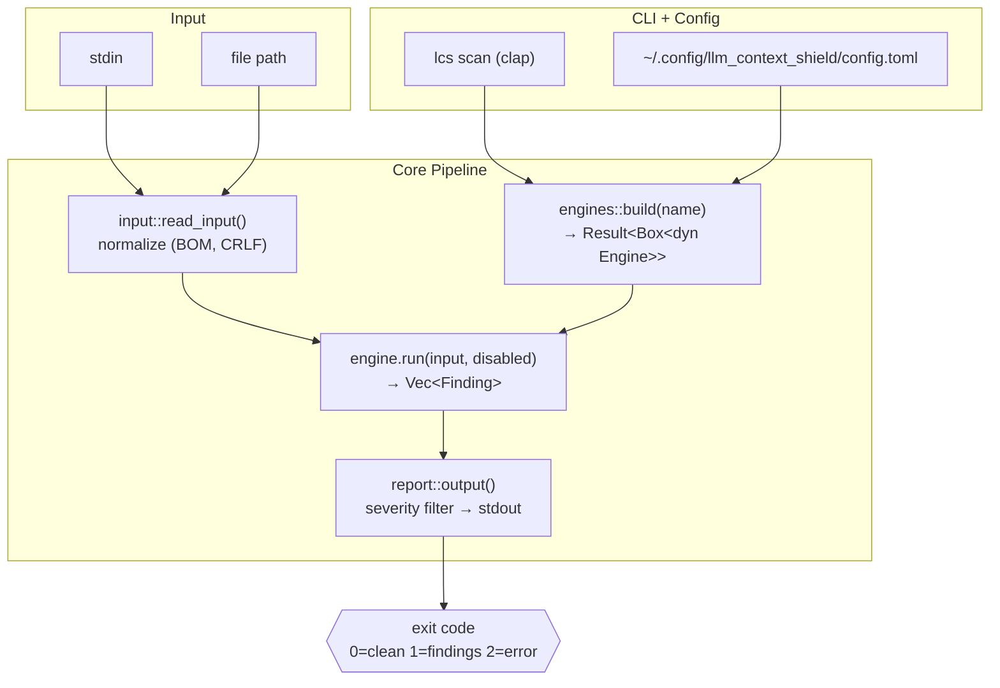
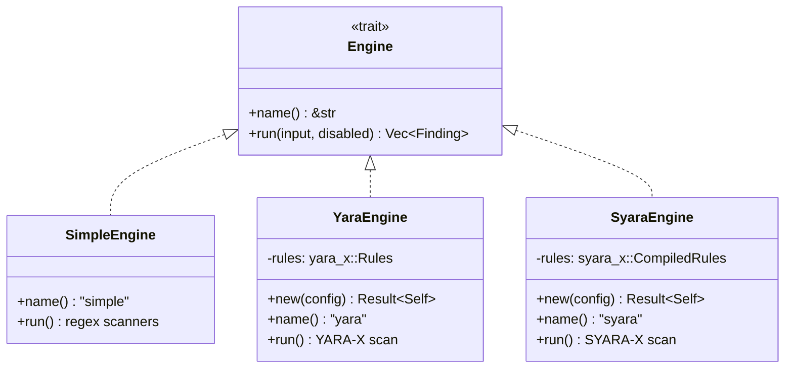
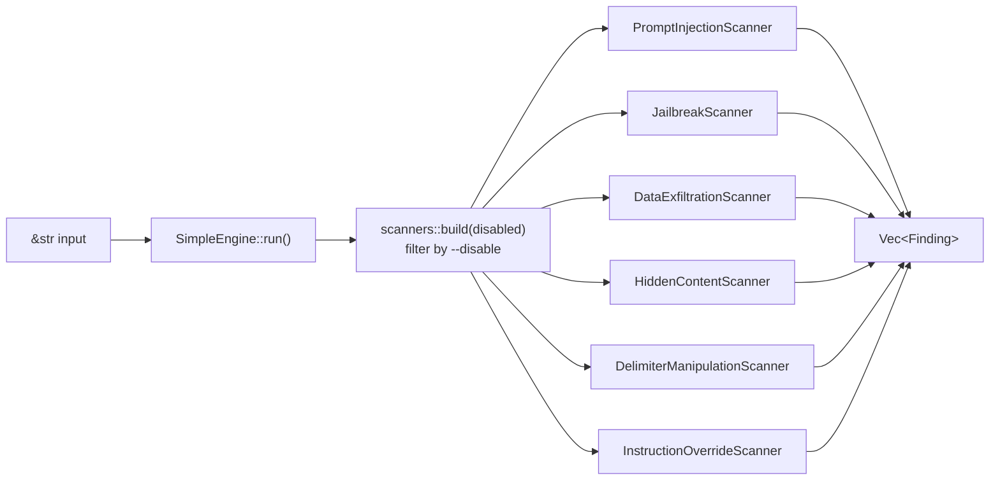
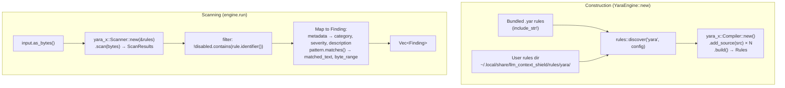
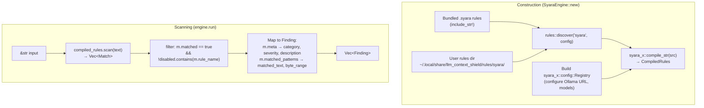
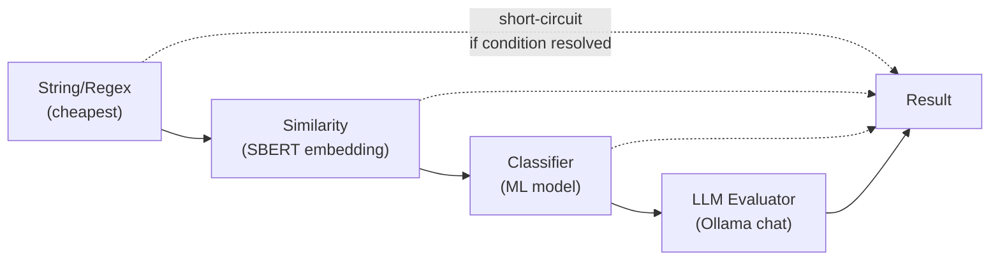
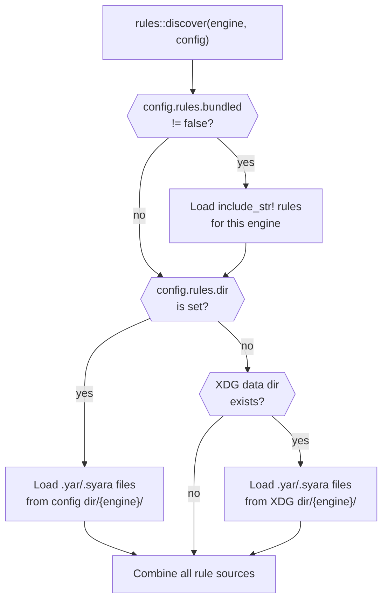
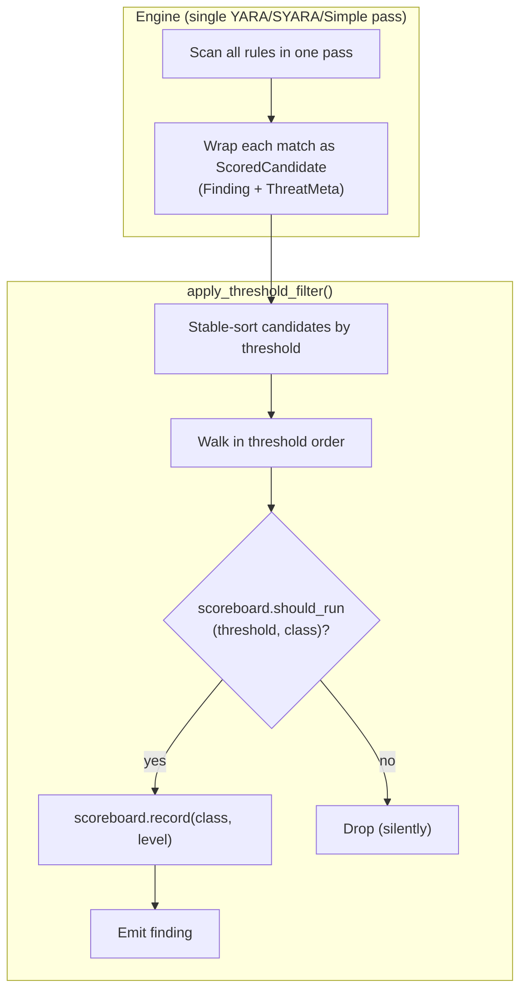

# Architecture — llm_context_shield

This document describes the architecture of `llm_context_shield` with a focus on the
three scan engines (Simple, YARA-X, SYARA-X) and how they integrate into the shared
pipeline.

---

## 1. High-Level Overview



The pipeline is linear and stateless: read → normalize → scan → report → exit.
The `Engine` trait is the single extension point.

---

## 2. Engine Abstraction

```rust
// src/engines/mod.rs
pub trait Engine: Send + Sync {
    fn name(&self) -> &'static str;
    fn run(&self, input: &str, disabled: &[String]) -> Vec<Finding>;
    fn rule_names(&self) -> Vec<String> { Vec::new() }
    fn run_scored(&self, input: &str, disabled: &[String]) -> (Vec<Finding>, ThreatScoreboard) {
        (self.run(input, disabled), ThreatScoreboard::new())
    }
}

pub fn build(name: &str, config: &Config) -> Result<Box<dyn Engine>, String>;
```



### Engine Selection

| Name | Cargo Feature | Dependency | Always Available |
|------|--------------|------------|-----------------|
| `simple` | *(none)* | built-in regex scanners | Yes |
| `yara` | `yara` | `yara-x` v1.14 (crates.io) | No |
| `syara` | `syara` | `syara-x` (path dep `../syara-x/syara`) | No |

Requesting an engine whose feature is not compiled produces a clear error:
`"Engine 'yara' requires the 'yara' Cargo feature. Rebuild with: cargo build --features yara"`

---

## 3. Data Flow — Simple Engine

The simple engine uses hardcoded Rust regex scanners. No external rule files.



Each scanner implements the `Scanner` trait and returns `Vec<Finding>` independently.
Overlapping findings across scanners are kept — each category carries distinct signal.

---

## 4. Data Flow — YARA-X Engine

The YARA engine loads `.yar` rule files and compiles them with `yara-x`.



### YARA-X API Usage

```
Compiler::new()
  .add_source(bundled_rule_src)?    // repeat per rule file
  .add_source(user_rule_src)?
  .build()                           // → Rules (compiled automaton)

Scanner::new(&rules)
  .scan(input.as_bytes())?           // → ScanResults

for rule in results.matching_rules() {
    // rule.identifier()  → rule name
    // rule.metadata()    → (name, MetaValue) pairs
    // rule.patterns()    → Pattern → .matches() → Match { range(), data() }
}
```

---

## 5. Data Flow — SYARA-X Engine

The SYARA engine loads `.syara` rule files and compiles them with `syara-x`.
SYARA extends YARA syntax with semantic matchers (SBERT, classifier, LLM).



### SYARA-X Execution Pipeline

SYARA-X evaluates rule conditions cheapest-first, short-circuiting expensive
matchers when earlier conditions already determine the outcome:



String-only rules (no `similarity:`, `classifier:`, or `llm:` sections) run with
zero network overhead — no Ollama dependency. This makes them suitable for CI and
for the bundled default rules.

---

## 6. Rule File Conventions

### Directory Layout

```
# Bundled (compiled into binary via include_str!)
rules/
  yara/
    prompt_injection.yar
    jailbreak.yar
    data_exfiltration.yar
    hidden_content.yar
    delimiter_manipulation.yar
    instruction_override.yar
  syara/
    prompt_injection.syara
    jailbreak.syara
    ...

# User rules (XDG Data Home)
~/.local/share/llm_context_shield/
  rules/
    yara/       ← flat directory of .yar files
    syara/      ← flat directory of .syara files
```

**Discovery order**: bundled rules → config `[rules] dir` → XDG data dir fallback.
All `.yar` or `.syara` files in the appropriate subdirectory are loaded.
Flat directories only — no recursive traversal.

User rules are loaded *in addition to* bundled rules, not as replacements.
A user can suppress any rule via `--disable rule_name`.

### Metadata Schema

Both YARA and SYARA rules must include `category` and `severity` in their `meta:` section
to produce a `Finding`. Rules missing either field are skipped with a `tracing::warn!`.

```yara
rule prompt_injection_ignore_previous : prompt_injection {
    meta:
        category    = "prompt_injection"
        severity    = "critical"
        description = "Instruction to ignore previous context"
        author      = "llm_context_shield"
        version     = "1"

    strings:
        $s1 = /ignore\s+(all\s+)?(previous|prior|above|earlier)\s+(instructions?|prompts?|directives?|rules?)/i
        $s2 = /disregard\s+(all\s+)?(previous|prior|above|earlier)\s+(instructions?|prompts?|directives?)/i

    condition:
        any of them
}
```

### Required Metadata Fields

| Field | Type | Maps to | Notes |
|-------|------|---------|-------|
| `category` | string | `Category` enum | Must match a variant name in snake_case |
| `severity` | string | `Severity` enum | `low`, `medium`, `high`, `critical` |
| `description` | string | `Finding.description` | Falls back to rule identifier if absent |

### Valid Category Values

`prompt_injection`, `hidden_content`, `data_exfiltration`, `jailbreak`,
`delimiter_manipulation`, `instruction_override`

---

## 7. Finding Mapping

### Shared Helper

```rust
// scanner.rs — new method
impl Category {
    pub fn from_str_loose(s: &str) -> Option<Category> {
        match s.to_lowercase().as_str() {
            "prompt_injection"      => Some(Category::PromptInjection),
            "hidden_content"        => Some(Category::HiddenContent),
            "data_exfiltration"     => Some(Category::DataExfiltration),
            "jailbreak"             => Some(Category::Jailbreak),
            "delimiter_manipulation" => Some(Category::DelimiterManipulation),
            "instruction_override"  => Some(Category::InstructionOverride),
            _ => None,
        }
    }
}
```

### YARA-X → Finding

For each `rule` in `scan_results.matching_rules()`:
1. Skip if `rule.identifier()` is in the `disabled` slice (case-insensitive)
2. Extract `category`, `severity`, `description` from `rule.metadata()`
3. Parse via `Category::from_str_loose` / `Severity::from_str_loose`
4. For each `pattern.matches()` → one `Finding` with:
   - `matched_text`: `String::from_utf8_lossy(match.data())`
   - `byte_range`: `(match.range().start, match.range().end)`
5. Condition-only rules (no pattern matches) → one Finding with empty matched_text

### SYARA-X → Finding

For each `Match` where `m.matched == true`:
1. Skip if `m.rule_name` is in the `disabled` slice
2. Extract metadata from `m.meta` HashMap
3. For each `MatchDetail` in `m.matched_patterns` values → one `Finding` with:
   - `matched_text`: `detail.matched_text`
   - `byte_range`: `(detail.start_pos, detail.end_pos)` — sentinel `-1` maps to `(0, 0)`
4. Semantic-only matches (empty matched_patterns) → one Finding with empty matched_text

---

## 8. Feature Flags

```toml
# Cargo.toml
[features]
default = []
yara = ["dep:yara-x"]
syara = ["dep:syara-x"]
syara-sbert = ["syara", "syara-x/sbert"]
syara-classifier = ["syara", "syara-x/classifier"]
syara-llm = ["syara", "syara-x/llm"]

[dependencies]
yara-x = { version = "1.14", optional = true }
syara-x = { path = "../syara-x/syara", optional = true }
```

### Conditional Compilation

```rust
// src/engines/mod.rs
pub mod simple;                        // always available

#[cfg(feature = "yara")]
pub mod yara;

#[cfg(feature = "syara")]
pub mod syara;

pub fn build(name: &str) -> Result<Box<dyn Engine>, String> {
    match name {
        "simple" => Ok(Box::new(SimpleEngine)),

        #[cfg(feature = "yara")]
        "yara" => YaraEngine::new().map(|e| Box::new(e) as _),

        #[cfg(feature = "syara")]
        "syara" => SyaraEngine::new().map(|e| Box::new(e) as _),

        #[cfg(not(feature = "yara"))]
        "yara" => Err("Engine 'yara' requires the 'yara' Cargo feature. \
                        Rebuild with: cargo build --features yara".into()),

        #[cfg(not(feature = "syara"))]
        "syara" => Err("Engine 'syara' requires the 'syara' Cargo feature. \
                         Rebuild with: cargo build --features syara".into()),

        _ => Err(format!("Unknown engine: {name}. Use: simple, yara, syara")),
    }
}
```

### Build Profiles

| Profile | Command | Engines Available |
|---------|---------|-------------------|
| Default | `cargo build` | simple |
| YARA | `cargo build --features yara` | simple, yara |
| SYARA (strings only) | `cargo build --features syara` | simple, syara |
| SYARA (full semantic) | `cargo build --features syara-llm,syara-sbert,syara-classifier` | simple, syara (all matchers) |
| Everything | `cargo build --features yara,syara-llm,syara-sbert,syara-classifier` | all |

---

## 9. Configuration Extensions

```toml
# ~/.config/llm_context_shield/config.toml

[scan]
engine = "simple"       # default engine
format = "text"
severity = "low"
disable = []

[rules]
# Override the default rules directory.
# Default: $XDG_DATA_HOME/llm_context_shield/rules/
# dir = "/path/to/custom/rules"

# Whether to load bundled (built-in) rules. Default: true.
# bundled = true

[syara]
# OpenAI-compatible LLM endpoint (LMStudio, OpenAI, vLLM, Ollama /v1 shim).
# Default: http://localhost:1234/v1/chat/completions (LMStudio)
# llm_endpoint = "http://localhost:1234/v1/chat/completions"

# Model name for embedding-based matchers (sbert, classifier).
# embed_model = "all-minilm"

# Model name for LLM evaluator.
# llm_model = "google/gemma-4-31b"
```

### New Config Structs

```rust
// src/config.rs
#[derive(Deserialize, Default)]
pub struct RulesConfig {
    pub dir: Option<String>,
    pub bundled: Option<bool>,
}

#[derive(Deserialize, Default)]
pub struct SyaraConfig {
    pub llm_endpoint: Option<String>,
    pub embed_model: Option<String>,
    pub llm_model: Option<String>,
    pub onnx_model_dir: Option<String>,
}

pub struct Config {
    pub log: Option<bool>,
    pub scan: Option<ScanConfig>,
    pub rules: Option<RulesConfig>,    // NEW
    pub syara: Option<SyaraConfig>,    // NEW
}
```

---

## 10. Rule Discovery Module

New module `src/rules.rs` handles finding and loading rule files:

```rust
pub fn discover(engine: &str, config: &Config) -> Vec<String> {
    // 1. Load bundled rules (include_str!) if config.rules.bundled != false
    // 2. Load from config.rules.dir/{engine}/ if set
    // 3. Fall back to $XDG_DATA_HOME/llm_context_shield/rules/{engine}/
    // Returns Vec of rule source strings (content, not paths)
}
```



---

## 11. Error Handling

| Condition | Behavior | Exit Code |
|-----------|----------|-----------|
| Rule compilation error (bad syntax) | `eprintln!` with file path + detail, `process::exit(2)` | 2 |
| Missing required metadata (category/severity) | `tracing::warn!`, skip rule, continue | 0 or 1 |
| Invalid metadata value (unknown category) | `tracing::warn!`, skip rule | 0 or 1 |
| Rules directory does not exist | `tracing::info!`, use bundled rules only | 0 or 1 |
| YARA-X scan error | `eprintln!`, `process::exit(2)` | 2 |
| SYARA-X scan error (Ollama unreachable) | `eprintln!`, `process::exit(2)` | 2 |
| Engine feature not compiled | `eprintln!` with rebuild instructions, `process::exit(2)` | 2 |

**Principle**: Compilation errors are fatal (misconfigured rules need fixing).
Missing optional files or metadata are warnings (graceful degradation).

---

## 12. Testing Strategy

### Unit Tests

- `scanner.rs`: `Category::from_str_loose` round-trips all variants, unknown returns `None`
- `engines/yara.rs`: Compile inline YARA rule, scan known-bad input, assert Finding fields;
  test missing metadata gracefully skipped; test `--disable` by rule name
- `engines/syara.rs`: Compile inline SYARA rule (string-only), verify Match-to-Finding mapping;
  test MatchDetail with `-1` positions maps to `(0, 0)`

### Integration Tests

```rust
// tests/integration.rs

#[cfg(feature = "yara")]
mod yara_tests {
    // Same payloads as simple engine tests, using -e yara
    // Validates bundled .yar rules detect the same threats
}

#[cfg(feature = "syara")]
mod syara_tests {
    // String-only rules — no Ollama dependency for CI
}
```

### CI Matrix

| Job | Command | Engines Tested |
|-----|---------|---------------|
| Default | `cargo test` | simple only |
| YARA | `cargo test --features yara` | simple + yara |
| SYARA | `cargo test --features syara` | simple + syara (strings only) |
| Full | `cargo test --features yara,syara` | all engines |

SYARA tests requiring Ollama are gated behind `#[ignore]`.

---

## 13. Implementation Phases

### Phase 1: Foundation (no new dependencies)

1. Add `Category::from_str_loose()` to `src/scanner.rs`
2. Add `RulesConfig`, `SyaraConfig` to `src/config.rs`; update `DEFAULT_CONFIG`
3. Create `src/rules.rs` — rule discovery logic (bundled + XDG + config dir)
4. Change `engines::build()` signature to `Result<Box<dyn Engine>, String>`
5. Update `src/main.rs` call site for new `build()` return type
6. Tests for new helpers

### Phase 2: YARA-X Engine

1. Add `yara-x` optional dependency and `yara` feature to `Cargo.toml`
2. Create `rules/yara/*.yar` — port existing regex patterns from `src/scanners/*.rs`
3. Implement `YaraEngine::new()` — compile bundled + discovered rules
4. Implement `YaraEngine::run()` — scan, metadata-to-Finding mapping, disable filtering
5. `#[cfg(feature = "yara")]` gates on module declaration
6. Unit tests + integration tests

### Phase 3: SYARA-X Engine

1. Add `syara-x` path dependency and feature flags to `Cargo.toml`
2. Create `rules/syara/*.syara` — string-only rules (mirrors YARA rules initially)
3. Implement `SyaraEngine::new()` — configure Registry from `[syara]` config, compile rules
4. Implement `SyaraEngine::run()` — scan, Match-to-Finding mapping, disable filtering
5. `#[cfg(feature = "syara")]` gates
6. Unit tests + integration tests (string-only for CI, `#[ignore]` for Ollama tests)

### Phase 4: Polish

1. Extend `lcs list` to show rule names when using yara/syara engines
2. Add `lcs init --rules` to create the XDG rules directory structure
3. Rule-writing guide in docs
4. Migration guide: expressing simple-engine patterns as YARA rules

---

## 14. Threat Scoring (Phase 7)

Phase 7 adds a multi-pass, threshold-gated scoring system on top of the existing
single-pass scan. Rules declare `threat_level`, `threshold`, and `threat_class`
metadata to control when they activate and how much they contribute to cumulative
threat scores.

### Post-Filter Architecture



**Key decision**: All rules compile and scan in a single pass. YARA-X compiles
all rules into a single monolithic `Rules` object — splitting by threshold tier
would require multiple `Compiler`/`Rules` instances (more memory, more complexity)
for negligible gain since YARA scanning is already fast. The post-filter approach
(`apply_threshold_filter` in `src/scoring.rs`) processes results in threshold
order after the scan completes. This is consistent across all three engines.

### Scoring Types

```
ThreatMeta { threat_level: i32, threshold: i32, threat_class: String }
ThreatScoreboard { class_scores: HashMap<String, i32>, cumulative: i32, ... }
ScoredCandidate { finding: Finding, meta: ThreatMeta }  // internal only
```

`ScoredCandidate` is `pub(crate)` — it pairs a `Finding` with its `ThreatMeta`
during scoring, then is stripped back to plain `Finding` before returning.
Scores surface via `ScanReport.scores: Option<ThreatScoreboard>`, not on
individual findings.

### Engine Trait Extension

```rust
fn run_scored(&self, input: &str, disabled: &[String]) -> (Vec<Finding>, ThreatScoreboard) {
    (self.run(input, disabled), ThreatScoreboard::new())  // default impl
}
```

The default implementation preserves backward compatibility for custom engines.
Built-in engines override `run_scored()` and have `run()` delegate to it.

### Cross-Branch Escalation

When any class score exceeds `escalation_threshold`, `effective_threshold()`
reduces thresholds for rules in *other* classes by `escalation_reduction`.
Default config: threshold=100, reduction=0 (inert until tuned with real data).

---

## 15. Design Decisions and Rationale

### Why compile rules at engine construction, not per-scan?

YARA-X compilation builds an automaton — it is expensive. Compiling once in the
constructor and reusing the `Rules` object is correct. For a one-shot CLI this happens
once per invocation anyway, but the design is future-proof for library use.

### Why bundled rules via `include_str!`?

The UNIX philosophy favors self-contained binaries. A user should be able to
`cargo install` and immediately scan without creating any directories. Bundled rules
provide the baseline; user rules extend it.

### Why not merge all engines into one?

The simple engine has value as a zero-dependency, zero-configuration baseline.
Feature gating keeps the default binary small (~2MB smaller without YARA-X).

### Why `Result` for `engines::build()` instead of `Option`?

A compilation error in a YARA rule file is qualitatively different from "unknown
engine name." The user needs to see the file path, line number, and error detail.
`Result<_, String>` carries that information without introducing a custom error type.

### Why flat rule directories?

Predictable behavior. `ls ~/.local/share/llm_context_shield/rules/yara/` shows exactly
what will be loaded. No surprises from nested subdirectories.

### Why one Finding per pattern match, not one per rule?

A single rule may match at multiple positions. Each position is independently valuable
for triage — the user needs to know *where* each match occurred. This matches the
existing simple engine behavior.

### Why keep the simple engine after YARA-X exists?

1. Zero dependencies — useful in constrained environments
2. No rule files to manage — works out of the box
3. Faster compilation — good for development
4. Reference implementation — validates that YARA rules produce equivalent results

---

## 15. Module Map

```
src/
  main.rs              ← CLI entry point, engine dispatch
  lib.rs               ← public module declarations
  cli.rs               ← clap argument parsing
  config.rs            ← TOML config (+ new RulesConfig, SyaraConfig)
  input.rs             ← stdin/file reading, normalization
  scanner.rs           ← Finding, Category, Severity types (+ from_str_loose)
  report.rs            ← output formatting (json, text, quiet)
  scoring.rs           ← threat scoring engine (ThreatMeta, ThreatScoreboard)
  rules.rs             ← rule file discovery and loading
  logging.rs           ← tracing setup
  engines/
    mod.rs             ← Engine trait, build() dispatch
    simple.rs          ← regex-based engine (existing)
    yara.rs            ← YARA-X engine (feature-gated)
    syara.rs           ← SYARA-X engine (feature-gated)
  scanners/
    mod.rs             ← scanner registry (used by simple engine)
    prompt_injection.rs
    jailbreak.rs
    data_exfiltration.rs
    hidden_content.rs
    delimiter_manipulation.rs
    instruction_override.rs
rules/
  yara/                ← bundled .yar rules (include_str! at compile time)
  syara/               ← bundled .syara rules
tests/
  integration.rs       ← integration tests (feature-gated sections)
```
